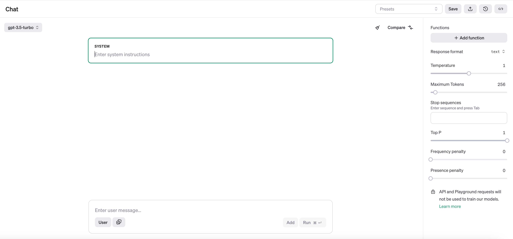
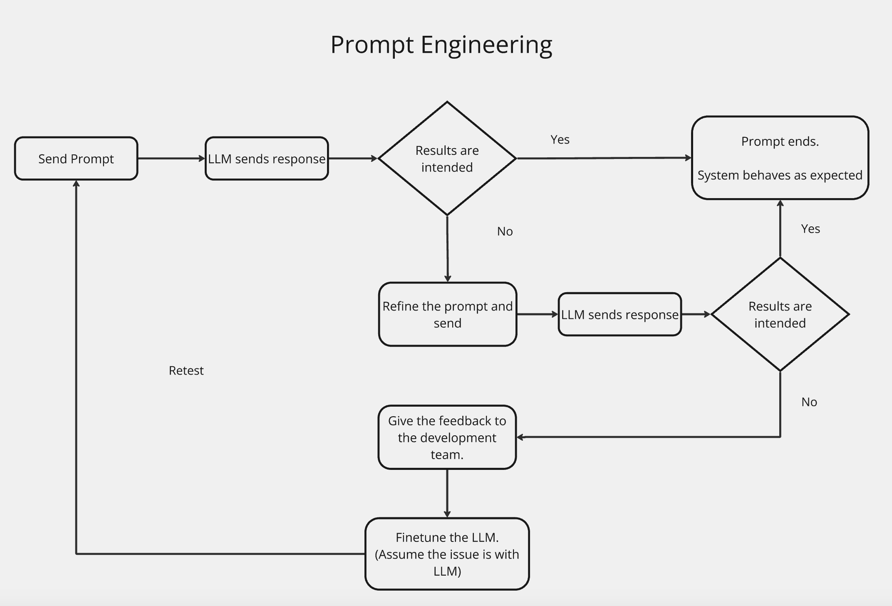

## Prompt Engineering Process
### What is Prompt Engineering?

- It's a method to check if an AI model or LLM (like GPT) responds correctly to a given prompt.
- Example: You provide a prompt in "MyLife" and check if the AI responds as expected.

### Why is it Important?

- The development team uses prompt engineering to ensure the LLM performs as intended.
- If the AI's response isn't as expected, the prompt or settings can be adjusted. Fine-tuning is a last resort.

### Tools:

- Use OpenAI Playground to refine prompts. This tool allows you to adjust settings to get the desired response with minimal prompts, reducing costs and improving efficiency.

### Key Settings:

- **Temperature:** Controls randomness. Lower values (e.g., 0.2) make the output more focused; higher values (e.g., 0.8) make it more creative.
- **Maximum Tokens:** Limits the length of the response. A higher number allows longer answers.
- **Stop Sequence:** Specifies when the response should stop, like at a specific word or symbol.

### Techniques:

- **Zero-shot prompts:** Ask the model without any example.
- **One-shot prompts:** Provide one example before asking.
- **Multi-shot prompts:** Provide multiple examples.
- **Chain of Thought:** Encourage step-by-step reasoning.

### Workflow:

